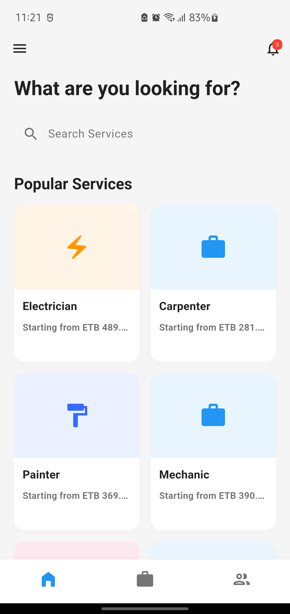
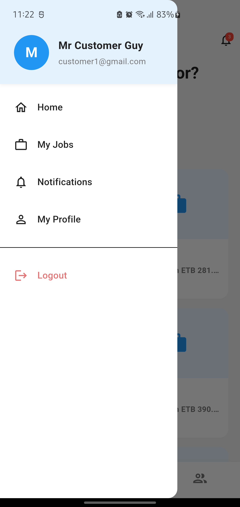
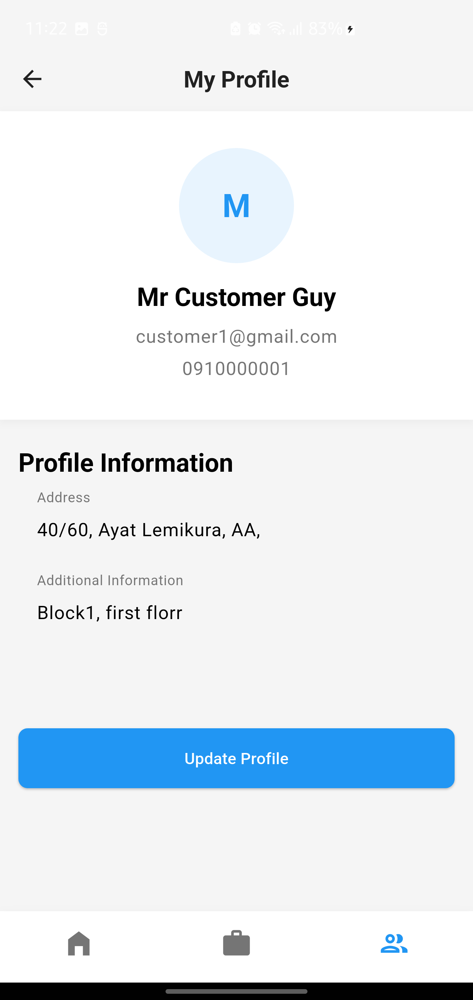
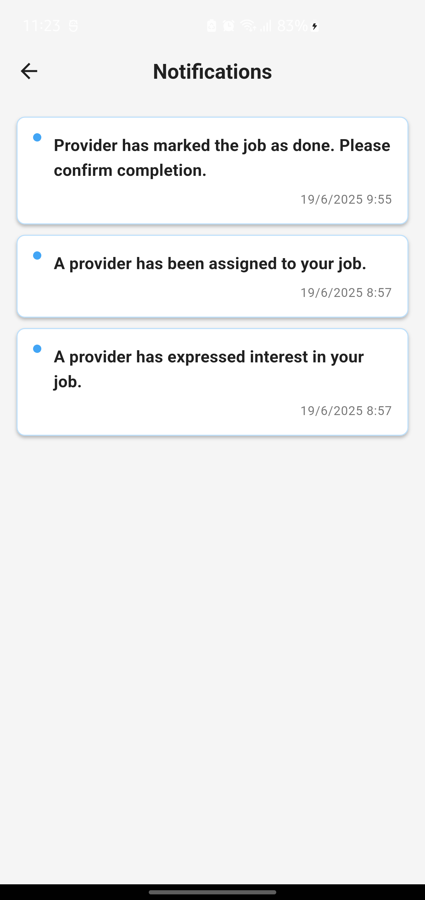
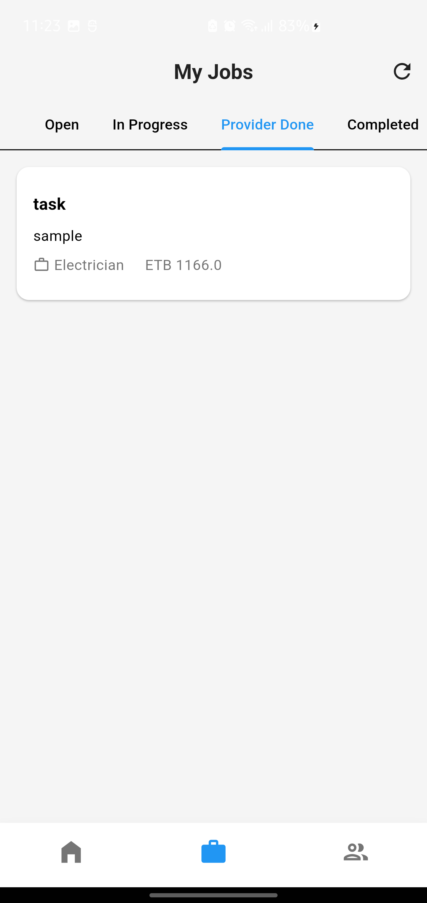
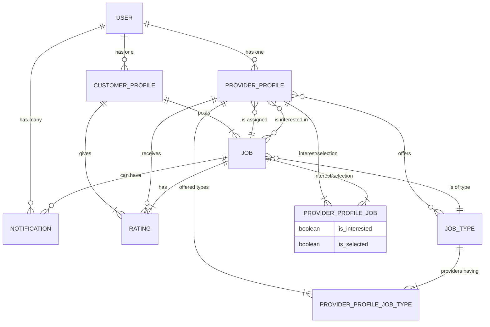

# Local Services Aggregator System

This is a full-stack application that serves as a platform for aggregating local services. It connects customers who need services with local providers who can offer them. The system consists of a backend API built with Laravel and a mobile application for customers and providers built with Flutter.

## ✨ Features

### Customer Features
-   **Authentication**: Register and log in as a customer.
-   **Profile Management**: Create and manage customer profiles.
-   **Job Posting**: Post new jobs with details like title, description, and proposed price.
-   **View Interested Providers**: See a list of providers who have expressed interest in a job.
-   **Select Provider**: Choose and select a provider for a job.
-   **Job Tracking**: Track the status of posted jobs (e.g., pending, in-progress, completed).
-   **Rate Providers**: Rate and provide feedback on providers after a job is completed.
-   **Notifications**: Receive notifications for important events.

### Provider Features
-   **Authentication**: Register and log in as a provider.
-   **Profile Management**: Create and manage provider profiles, including a bio and the types of services offered.
-   **Browse Jobs**: View a list of available jobs relevant to their services.
-   **Express Interest**: Show interest in jobs they are willing to take on.
-   **Manage Assigned Jobs**: Track and manage jobs they have been assigned.
-   **Update Job Status**: Mark jobs as completed.
-   **Notifications**: Receive notifications for job assignments and other updates.

### Admin Features
-   **Dashboard**: An admin panel to manage users, jobs, job types, and other aspects of the system.
-   **Analytics**: View analytics and insights about the platform's usage.

## 📱 Screenshots

<table>
  <tr>
    <td align="center">
      
    </td>
    <td align="center">
      
    </td>
    <td align="center">
      
    </td>
  </tr>
  <tr>
    <td align="center">
      
    </td>
    <td align="center">
      
    </td>
    <td align="center">
      
    </td>
  </tr>
</table>

### Admin Panel Screenshots

## 🛠️ Technology Stack

### Backend
-   **Framework**: Laravel 12
-   **PHP Version**: 8.2
-   **Authentication**: Laravel Sanctum
-   **Admin Panel**: Filament 3
-   **Database**: PostgreSQL

### Frontend
-   **Framework**: Flutter 3
-   **State Management**: Provider
-   **Networking**: Dio
-   **Local Storage**: Shared Preferences

## 🏗️ Architecture

### Backend Architecture
The backend is a monolithic application built with the Laravel framework. It follows the standard MVC pattern and provides a RESTful API for the frontend application. It uses Laravel Sanctum for API token-based authentication. The Filament admin panel is integrated for easy administration of the application's data.

### Frontend Architecture
The frontend is a Flutter application that follows the principles of Clean Architecture. The code is structured into three main layers:
-   **Domain**: Contains the core business logic, models (entities), and repository interfaces.
-   **Data**: Implements the repositories defined in the domain layer and is responsible for fetching data from the API.
-   **Presentation**: Contains the UI (Widgets/Screens) and the state management logic (Providers) that connects the UI to the business logic.

## 🗄️ Database Schema

## 🔌 API Endpoints

A summary of the main API endpoints. All protected routes require `auth:sanctum` authentication.

### Public Routes
-   `POST /api/auth/register`
-   `POST /api/auth/login`
-   `GET /api/job-types`

### Protected Routes
-   **Auth**: `POST /api/auth/logout`
-   **Jobs**:
    -   `GET /api/jobs`
    -   `POST /api/jobs`
    -   `GET /api/jobs/{job}`
    -   `POST /api/jobs/{jobId}/express-interest`
    -   `GET /api/jobs/{job}/interested-providers`
    -   `POST /api/jobs/{job}/select-provider`
    -   `POST /api/jobs/{job}/rate-provider`
    -   ...and more for job status updates.
-   **Profiles (Customer & Provider)**: `GET`, `POST`, `PUT` endpoints for `/api/customer-profile` and `/api/provider-profile`.
-   **Notifications**: `GET /api/notifications`, `POST /api/notifications/{id}/read`
-   **Provider Jobs**: `GET /api/requested-jobs`, `GET /api/selected-jobs`

## 🚀 Getting Started

### Prerequisites
-   PHP >= 8.2
-   Composer
-   Node.js & npm
-   Flutter SDK
-   PostgreSQL

### Backend Setup
1.  Navigate to the `backend` directory: `cd backend`
2.  Copy the environment file: `cp .env.example .env`
3.  Install PHP dependencies: `composer install`
4.  Install NPM dependencies: `npm install`
5.  Generate an application key: `php artisan key:generate`
6.  Configure your database credentials in the `.env` file.
7.  Run database migrations: `php artisan migrate`
8.  (Optional) Seed the database: `php artisan db:seed`
9.  Start the development server: `php artisan serve` or use the configured `dev` script: `composer run dev`

### Frontend Setup
1.  Navigate to the `frontend` directory: `cd frontend`
2.  Install Flutter dependencies: `flutter pub get`
3.  Make sure the backend server is running and the API endpoint is correctly configured in `frontend/lib/core/config/api_config.dart`.
4.  Run the app: `flutter run`

## 👨‍💻 Admin Panel
The application includes a comprehensive admin panel built with Filament. To access it:
1.  Ensure the backend server is running.
2.  Create an admin user. You can do this via a seeder or by creating a user and setting their `role` to `admin` in the database.
3.  Navigate to `/admin` in your browser.
4.  Log in with the admin user's credentials.

From the admin panel, you can manage users, jobs, job types, ratings, and more. 